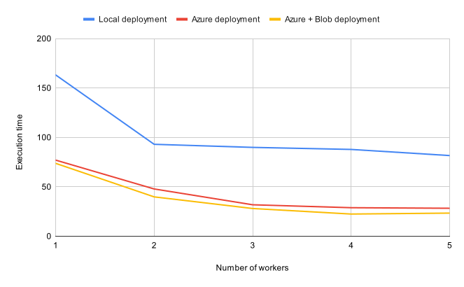
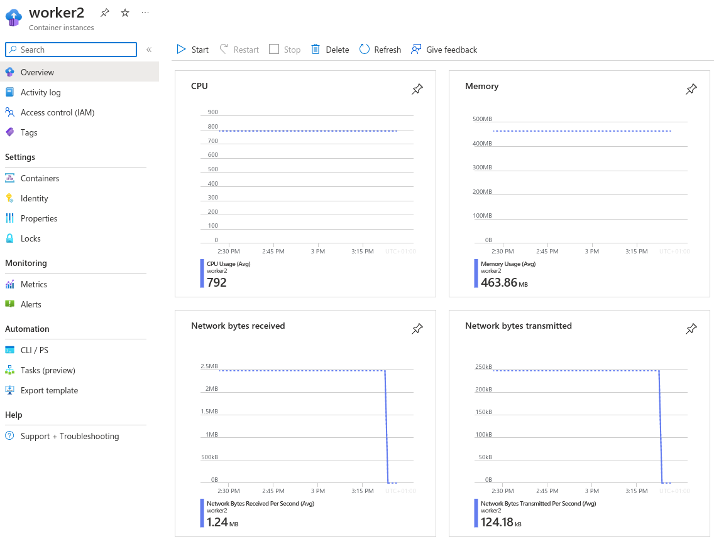

# CBDP - Report Assignment 5

> Ivan Logvynenko
> Ludovico Capiaghi

## 1. Azure Deployment and Testing

First of all we want to explain how we obtained the results we are presenting in the following answer. 

The local machine used for the tests has an Intel® Core™ i7-9750H × 12 processor. The bandwidth used for the first tests was particularly poor and not regular. While in previous assignment we switch to a better connection for the test, we think in this case the the results obtained help to emphasize better the differences with the azure deployment, that on the other hand provides faster and stable connectivity (our different runs didn't show significant variation in term of execution time).

 We realized that the Azure Student subscription is limited to 6 cores for region so we decided to always use 1 core for every process so we limited our test with number of workers in the range [1,5].  

We used a bash script to automatize the test, also for the azure deployment. We were tried to spawn the workers (also in Azure) mostly "simultaneously". We measure the elapsed time between worker's connection in the coordinator and we rarely exceeded the 1s. So using our previous solution the coordinator starts to assign work to workers as soon as possible, meaning that some worker in this deployment could end up doing more work. However when testing the deployment on Azure we opt to spawn the coordinator container before the workers (to get its IP correctly and also to possibly avoid keeping workers in while true attempting to connect). So the execution time reported is the elapsed time to execute the query starting from when the first worker showed up.

The following chart presents the execution time in seconds (from the first worker arrival) to complete assignment 4 query with different number of workers and for three different deployment:

- Local deployment: using local machine and data stored on `db.in.tum.de`
- Azure deployment: using Azure containers with 1 core each (and standard memory) and data stored on `db.in.tum.de`
- Azure + Blob deployment :  using Azure containers with 1 core each (and standard memory) and data stored on Azure Blob



### I)

Just by moving the computation on Azure we see that  execution time drastically decreases. Of course we could obtain similar (or better) results by using a more powerful machine and especially having a better connection for the local test configuration as we did during the tests for assignment 4. What is possibly not achievable with a local configuration is the stability that Azure offers. It was really easy to notice that our execution time were almost identical between different runs (same number of workers).

### II)

We tried to analyze Azure monitoring panel for the containers and we noticed that the networks metrics presented consumes while we encountered problems visualizing the CPU usage. We can imagine that the bottleneck of the process is the network-bound, this is partly proven by the improvement we obtain just by moving our data to Azure Blob.

### III)

By moving the data storage in Azure Blob we can significantly reduce the latency during our query computation, especially because our workers are  running in Azure containers in the same region. This is proved by the execution time we obtained. On average the execution with data stored in Azure Blob around 6 second faster than the execution with data store on `db.in.tum.de`

##  2) Managing Shared State

### I)

We've followed the proposed execution schema and chosen a partitioning based on hashing `hash(the domain) mod n_partitions`, it seemed to use the best approach to split equally the domains, this intuition was confirmed empirically by the execution of our solution on the data.

### II)

When we come to consider the optimal number of partitions we have to consider that our solution uses azure storage to store the shared states so it implies additional network load, so network become the big bottleneck of the computation. The number of subpartitions determines how much each  merge task will cost a worker, but that cost will be dominated by the network latency. So, testing locally, we noticed that a good amount of subpartitions is around the number of workers and that increasing it will regularly then slow down the overall execution time. Also we noticed empirically that we our configuration is more efficient when we use a number of partitions that is dividable for the number of workers we are using, this is because also in the merge phase each workers has always work to do.

| workers/n partitions | 1      | 2      | 3      | 4      | 5      | 8      | 10    | 12     | 15    | 16     |
| -------------------- | ------ | ------ | ------ | ------ | ------ | ------ | ----- | ------ | ----- | ------ |
| 1                    | 387.64 | 417.15 | 426.53 |        |        |        |       |        |       |        |
| 2                    | 253.99 | 249.62 | 252.09 | 256.48 |        |        |       |        |       |        |
| 3                    | 206.32 | 202.47 | 201.56 | 202.62 |        |        |       |        |       |        |
| 4                    |        |        |        | 200.69 |        | 199.46 |       | 198.45 |       | 200.15 |
| 5                    |        |        |        |        | 200.49 |        | 201.2 |        | 202.5 |        |

The execution time consider the time since the first worker showed up and are expressed in seconds. 

The best result we've got was to create 12 partitions for 4 workers. While as we can start to see using an increasing number of partitions doesn't imply an improvement in performances, in fact it's quite the opposite, because even though the computation in this task is a bit more heavy, the bottleneck still remains the network and by increasing the number of partitions we also increase the number of shared_states that have to be moved stored and read over the network, generating heavy delays especially in poor network conditions.

### III)

The coordinator does know the number of partitions `n_parts` that are being used in the first task (it's one of its input argument and it's shared with the workers for the execution of the first phase). Then basically the coordinator knows that `n_parts` have to be processed have to be processed in the merge phase. In particular, we use a convention to differentiate the shared state of the two phase:

- we use one container `cbdp-5-aggr-<random1>` to collect the result of the partial aggregation phase, here the a worker that is processing the chunk `chunk_n` will save all the domains that, for example, map to the value `0` (`hash (domain) mod n_part`) and their frequency to the blob `0_chunk_`
- we then use the naming convention of the previous step to identify the blobs that a specific worker has to process in the merge phase. For example, a worker that receives for the merge task `0` know that will have to look in the container `cbdp-5-aggr-<random1>` for all the blobs that starts with `0`. Then once it finished the processing will save the results in `cbdp-5-merge-<random2>` in the blob `0_top25`
- the final merge is done by the coordinator simply by computing the overall top 25 using all the blobs in `cbdp-5-merge-<random2>`

### IV)

We tried to implement a simple "API" to differentiate the type of task submitted to the worker by the coordinator. The "API" is implemented in `src/Api.h` and `src/Api.cpp`. The main element of the "API" is the `struct` `TaskApi` that contains all the information need by the client to perform a task (more details in the comments in the code).  Then `taskApi` can be converted to string (used by the coordinator) and created from a string (used by the client), so it can be easily shared via sockets. 

We decided to follow this approach to try to be more generic and hopefully more modular. Just as proof of concept (and also because it was useful to us) we implemented the upload (upload of the chunks to a container) as an additional operation  whose execution can be distributed among workers.

### V)

To answer this question, as we were short on time and given the fact that creating azure containers requires considerable amount of time to be created, we decided to test  with a fixed amount of workers, 5 (the best we can do with Azure student fixed limits of cores).

| n. subpartitions -> | 2    | 3    | 4     | 5     | 8     | 10    | 15     | 20     |
| ------------------- | ---- | ---- | ----- | ----- | ----- | ----- | ------ | ------ |
| 5 workers           | 74.1 | 64.3 | 57.08 | 66.14 | 79.98 | 94.41 | 132.28 | 159.83 |

The execution time consider the time since the first worker showed up and are expressed in seconds (most of them just one attempt...some average). 

We cannot guarantee for the stability and quality of the network in which we tested our solution locally, but we again evidently confirm that the network is the real bottleneck for the execution of this assignment query. Moving the computation in azure (and using azure storage) we reduce latency and by extent we drastically improve the overall execution time. The results confirm, with more clarity (given the stability of the configuration) what discussed at II.

Again for this test we're not really able to state something by looking at the control panel of Azure, but we include the measurement for the execution of `worker2` in the case of 5 subpartitions.




## 3)Notes

### I) About our solution

The folder `src/` contains all the source code files, in particular the interesting files are:

- `Api.h` and `Api.cpp`:  "API" logic that defines the standard to share task between coordinator and workers
- `Client.cpp` and `Client.h`: utility to implement the client side in client-server model using sockets 
- `coordinator.cpp` : can execute two distributed operation compute (execute assignment query) or upload (uploads chunks to azure storage). By default (flag `KEEP_INT_STATES = false`) we delete the intermediate shared states after completing the execution.
- `runWorker.cpp` : workers main script, using `Worker.h` and `Client.h`, it tries (up to 20 times) to connect to the coordinator and then waits for tasks and execute them until the socket it's closed (by the coordinator in the normal case).
- `Server.h` and `Server.cpp` : utility class that just separate the server socket preparation
- `Timer.h` and `Timer.cpp`: utility class to measure execution time
- `Worker.h` and `Worker.cpp` : logic to solve different task (worker side)

To execute the assignment query our solution requires access to Azure Storage, because we had time only to implement support for computation of shared states in Azure Storage containers. In particular, we need the chunks of assignment 1 in one container (`/scripts/upload.sh` can help with this) and access to azure storage (partly automated by our script, described in thenext section).

### II) Script to test

The folder `scripts/` contains all the scripts, every scripts start with a description and an example

- `config.sh`  is the most important file to correctly use our tests script, here you need to correctly set the variable required from the scripts (detailed description directly in script).. We also need the scripts to be run from an azure authenticated bash (**az login**).

- **Running locally** (run +  **tests**)

  - to run locally, executable are needed, our build is the default one:

    ```bash
    mkdir -p cmake-build-debug && cd cmake-build-debug && cmake .. && make worker coordinator
    ```

  - `compute.sh`: runs the solution locally and checks for its correctness

    - needs `STORAGE_ACCOUNT` and  `SOURCE_CONTAINTER` in `config.sh`

    ```bash
    ./compute.sh <n_workers> <n_subpartitions>
    ```

  - `testWorkload.sh`:  runs the solution locally, checks for its correctness and prints the number each task executed by each worker (to keep trace of them we have a specific log of the worker that identifies an operation that has been successfully completed)

    - needs `STORAGE_ACCOUNT` and  `SOURCE_CONTAINTER` in `config.sh`

    ```bash
    ./testWorkload.sh <n_workers> <n_subpartitions>
    ```

  - `testResilience.sh`:  runs the solution locally (with more than 2 workers) and kills two of the workers during it, at the end checks the result correctness

    - needs `STORAGE_ACCOUNT` and  `SOURCE_CONTAINTER` in `config.sh`

    ```bash
    ./testResilience.sh <n_workers> <n_subpartitions>
    ```

- **Running on docker**

  - `buildImages.sh`: build worker and coordinator images

    ```bash
    ./buildImages.sh
    ```

  - `computeDocker.sh`: runs the solution using docker and checks for its correctness (requires images to be built)

    - needs `STORAGE_ACCOUNT` ,  `SOURCE_CONTAINTER` `COORD_IMAGE` and `WORKER_IMAGE` in `config.sh`

    ```bash
    ./computeDocker.sh <n_workers> <n_subpartitions>
    ```

- **Running on Azure**

  - `computeAZ.sh`: runs the solution with Azure containers and checks for its correctness (requires images to be uploaded)

    - needs all vars in `config.sh` correctly set

    ```bash
    ./buildImages.sh && ./pushImgToAz.sh #(build and upload images)
    ./computeAZ.sh <n_workers> <n_subpartitions>
    ```